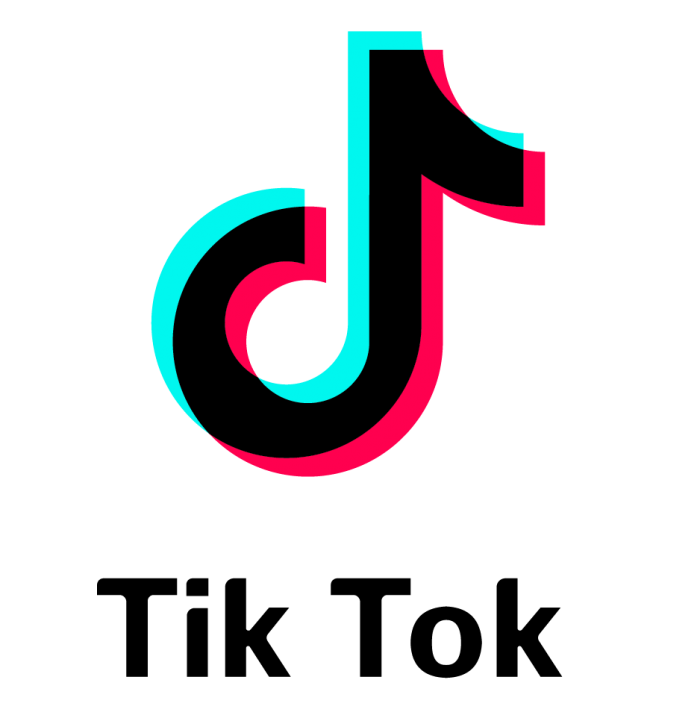

<!--Banner-->

<!--Night Owl image-->

<!--Header Name-->
#  ɪ'ᴍ RIJAL! 
*Lecturer | Digital Creator | Machine Learning Enthusiast | Tech Enthusiast*
  

- 👋 Hi, I’m Muhammad Rijal 
- 👀 I’m interested in Machine Learning
- 🌱 I’m currently learning Web Development with PHP use Laravel Framework, i'm also learning Python
- 📫 How to reach me, https://www.linkedin.com/in/muhammad-rijal98/ , https://rijal98.github.io/me/

---

<!--Contact Section--> 

<h2 align="center">🤝 Cᴏɴɴᴇᴄᴛ Wɪᴛʜ Mᴇ 🤝 </h2>

  

 

<!--Footer--> 

  

<!---
rijal98/rijal98 is a ✨ special ✨ repository because its `README.md` (this file) appears on your GitHub profile.
You can click the Preview link to take a look at your changes.
--->
